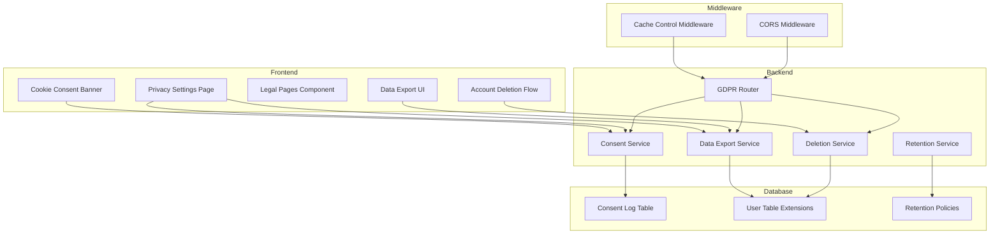

# Design Document: GDPR Compliance Implementation

## Overview

This design document describes the implementation of GDPR compliance features for the Magic: The Gathering deck generator web application. The solution implements a comprehensive privacy framework including cookie consent management, user data rights (access, erasure, portability), privacy policies, and data retention mechanisms.

The implementation follows a layered architecture:
- **Frontend Layer**: React components for cookie consent banner, privacy settings, and legal pages
- **Backend Layer**: FastAPI endpoints for data export, account deletion, and consent logging
- **Data Layer**: SQLite database extensions for consent logs and retention policies
- **Middleware Layer**: HTTP headers and caching controls for security

Key design decisions:
1. **Cookie Consent First**: No non-essential cookies are set until explicit user consent
2. **Granular Control**: Users can control Essential, Analytics, and Marketing cookies independently
3. **Audit Trail**: All consent decisions are logged with timestamps for compliance demonstration
4. **Automated Cleanup**: Background jobs enforce data retention policies automatically
5. **User-Friendly**: Privacy controls are centralized in account settings for easy access

## Architecture

### System Components



### Data Flow

**Cookie Consent Flow:**
1. User visits site → Frontend checks localStorage for consent decision
2. If no decision exists → Display consent banner
3. User makes selection → POST to `/api/gdpr/consent`
4. Backend logs consent → Returns confirmation
5. Frontend stores decision in localStorage → Enables/disables cookie categories

**Data Export Flow:**
1. User clicks "Download My Data" → POST to `/api/gdpr/export`
2. Backend authenticates user → Queries all user data
3. Backend formats data as JSON → Generates download token
4. Backend returns download URL → Frontend initiates download
5. Download link expires after 24 hours

**Account Deletion Flow:**
1. User requests deletion → POST to `/api/gdpr/delete-account`
2. Backend requires password confirmation → Creates deletion request
3. Backend sends confirmation email with cancellation link
4. After 7 days (if not cancelled) → Background job deletes all user data
5. Backend sends final confirmation email

## Components and Interfaces

### Frontend Components

#### CookieConsentBanner Component

**Purpose**: Display cookie consent banner on first visit and manage user preferences.

**Props**:
```typescript
interface CookieConsentBannerProps {
  onConsentChange: (consent: ConsentDecision) => void;
}

interface ConsentDecision {
  essential: boolean;      // Always true
  analytics: boolean;
  marketing: boolean;
  timestamp: string;
}
```

**State**:
- `showBanner: boolean` - Whether to display the banner
- `showDetails: boolean` - Whether to show detailed cookie information
- `consent: ConsentDecision` - Current consent selections

**Methods**:
- `acceptAll()` - Accept all cookie categories
- `rejectNonEssential()` - Accept only essential cookies
- `saveCustomPreferences()` - Save granular selections
- `loadStoredConsent()` - Load consent from localStorage

**Behavior**:
- Checks localStorage on mount for existing consent
- If no consent found, displays banner immediately
- Blocks non-essential cookies until consent provided
- Stores consent decision in localStorage with 12-month expiry
- Sends consent to backend for audit logging

#### PrivacySettings Component

**Purpose**: Centralized privacy control panel in user account settings.

**Props**:
```typescript
interface PrivacySettingsProps {
  user: User;
  token: string;
}
```

**State**:
- `cookiePreferences: ConsentDecision` - Current cookie settings
- `loading: boolean` - Loading state for async operations
- `exportStatus: 'idle' | 'generating' | 'ready' | 'error'`
- `deletionStatus: 'idle' | 'confirming' | 'pending' | 'error'`

**Methods**:
- `updateCookiePreferences(consent: ConsentDecision)` - Update cookie settings
- `requestDataExport()` - Initiate data export
- `requestAccountDeletion(password: string)` - Initiate account deletion
- `cancelDeletion(token: string)` - Cancel pending deletion

#### LegalPages Component

**Purpose**: Display Privacy Policy and Terms of Service with version tracking.

**Props**:
```typescript
interface LegalPagesProps {
  pageType: 'privacy' | 'terms';
}
```

**State**:
- `content: string` - Markdown content of legal document
- `lastUpdated: string` - Date of last update
- `userAcceptedVersion: string | null` - Version user accepted

**Methods**:
- `loadContent()` - Load legal document content
- `acceptPolicy()` - Record user acceptance of current version
- `checkForUpdates()` - Compare user's accepted version with current

#### DataExportButton Component

**Purpose**: Trigger and download user data export.

**Props**:
```typescript
interface DataExportButtonProps {
  token: string;
  onExportComplete: () => void;
}
```

**Methods**:
- `initiateExport()` - POST to export endpoint
- `downloadFile(url: string)` - Download generated export file

#### AccountDeletionFlow Component

**Purpose**: Multi-step account deletion with confirmation.

**Props**:
```typescript
interface AccountDeletionFlowProps {
  user: User;
  token: string;
  onDeletionInitiated: () => void;
}
```

**State**:
- `step: 'confirm' | 'password' | 'pending' | 'complete'`
- `password: string`
- `error: string | null`

**Methods**:
- `confirmDeletion()` - Show password confirmation
- `submitDeletion(password: string)` - Submit deletion request
- `cancelDeletion()` - Cancel the deletion flow

### Backend Services

#### ConsentService

**Purpose**: Manage cookie consent logging and retrieval.

**Methods**:

```python
class ConsentService:
    def log_consent(
        self,
        user_id: int | None,
        consent: ConsentDecision,
        ip_address: str,
        user_agent: str,
        banner_version: str
    ) -> ConsentLog:
        """
        Log a consent decision to the database.
        Creates audit trail for GDPR compliance.
        """
        pass
    
    def get_user_consent_history(
        self,
        user_id: int
    ) -> List[ConsentLog]:
        """
        Retrieve all consent decisions for a user.
        Used for data export and audit purposes.
        """
        pass
    
    def get_current_consent(
        self,
        user_id: int | None,
        session_id: str | None
    ) -> ConsentDecision | None:
        """
        Get the most recent consent decision for a user or session.
        """
        pass
    
    def cleanup_old_consents(self) -> int:
        """
        Delete consent logs older than 3 years.
        Returns count of deleted records.
        """
        pass
```

#### DataExportService

**Purpose**: Generate comprehensive user data exports in JSON format.

**Methods**:

```python
class DataExportService:
    def export_user_data(
        self,
        user_id: int
    ) -> dict:
        """
        Compile all user data into a structured dictionary.
        Includes: account info, decks, collections, consent history.
        """
        pass
    
    def generate_export_file(
        self,
        user_id: int
    ) -> str:
        """
        Create JSON file with user data and return download token.
        Token valid for 24 hours.
        """
        pass
    
    def get_export_file(
        self,
        token: str
    ) -> tuple[bytes, str]:
        """
        Retrieve export file by token.
        Returns (file_content, filename).
        Raises exception if token expired or invalid.
        """
        pass
```

#### DeletionService

**Purpose**: Handle account deletion requests with grace period.

**Methods**:

```python
class DeletionService:
    def initiate_deletion(
        self,
        user_id: int,
        password: str
    ) -> DeletionRequest:
        """
        Create deletion request with 7-day grace period.
        Sends confirmation email with cancellation link.
        Raises exception if password incorrect.
        """
        pass
    
    def cancel_deletion(
        self,
        cancellation_token: str
    ) -> bool:
        """
        Cancel a pending deletion request.
        Returns True if successful, False if token invalid/expired.
        """
        pass
    
    def execute_deletion(
        self,
        user_id: int
    ) -> None:
        """
        Permanently delete all user data.
        Called by background job after grace period.
        Deletes: user account, decks, collections, consents, tokens.
        """
        pass
    
    def process_pending_deletions(self) -> int:
        """
        Background job: process all deletion requests past grace period.
        Returns count of accounts deleted.
        """
        pass
```

#### RetentionService

**Purpose**: Enforce data retention policies automatically.

**Methods**:

```python
class RetentionService:
    def cleanup_inactive_accounts(self) -> int:
        """
        Delete accounts inactive for 3+ years.
        Sends warning email 30 days before deletion.
        Returns count of accounts deleted.
        """
        pass
    
    def cleanup_unverified_accounts(self) -> int:
        """
        Delete unverified accounts older than 90 days.
        Returns count of accounts deleted.
        """
        pass
    
    def cleanup_expired_tokens(self) -> int:
        """
        Delete expired password reset and verification tokens.
        Password reset: 24 hours, Verification: 7 days.
        Returns count of tokens deleted.
        """
        pass
    
    def run_all_cleanup_tasks(self) -> dict:
        """
        Execute all retention cleanup tasks.
        Returns summary of deletions by category.
        """
        pass
```

### Backend API Endpoints

#### GDPR Router (`/api/gdpr`)

**POST /api/gdpr/consent**
```python
Request:
{
    "essential": true,
    "analytics": boolean,
    "marketing": boolean,
    "banner_version": string
}

Response:
{
    "success": true,
    "consent_id": int,
    "timestamp": string
}
```

**GET /api/gdpr/consent**
```python
Headers: Authorization: Bearer <token>

Response:
{
    "current_consent": {
        "essential": true,
        "analytics": boolean,
        "marketing": boolean,
        "timestamp": string
    },
    "history": [
        {
            "consent_id": int,
            "essential": true,
            "analytics": boolean,
            "marketing": boolean,
            "timestamp": string,
            "banner_version": string
        }
    ]
}
```

**POST /api/gdpr/export**
```python
Headers: Authorization: Bearer <token>

Response:
{
    "download_url": string,
    "expires_at": string,
    "file_size_bytes": int
}
```

**GET /api/gdpr/download/:token**
```python
Response: File download (application/json)
Headers:
    Content-Disposition: attachment; filename="user_data_<user_id>.json"
    Content-Type: application/json
```

**POST /api/gdpr/delete-account**
```python
Headers: Authorization: Bearer <token>

Request:
{
    "password": string,
    "confirmation": "DELETE MY ACCOUNT"
}

Response:
{
    "success": true,
    "deletion_scheduled": string,  // ISO timestamp
    "cancellation_token": string,
    "message": "Account deletion scheduled. Check email for cancellation link."
}
```

**POST /api/gdpr/cancel-deletion**
```python
Request:
{
    "cancellation_token": string
}

Response:
{
    "success": true,
    "message": "Account deletion cancelled successfully."
}
```

**GET /api/gdpr/privacy-policy**
```python
Response:
{
    "content": string,  // Markdown content
    "version": string,
    "last_updated": string,
    "effective_date": string
}
```

**GET /api/gdpr/terms-of-service**
```python
Response:
{
    "content": string,  // Markdown content
    "version": string,
    "last_updated": string,
    "effective_date": string
}
```

**POST /api/gdpr/accept-policy**
```python
Headers: Authorization: Bearer <token>

Request:
{
    "policy_type": "privacy" | "terms",
    "version": string
}

Response:
{
    "success": true,
    "accepted_at": string
}
```

## Data Models

### ConsentLog Model

```python
class ConsentLog(Base):
    __tablename__ = "consent_logs"
    
    id = Column(Integer, primary_key=True, index=True)
    user_id = Column(Integer, ForeignKey('users.id'), nullable=True, index=True)
    session_id = Column(String, nullable=True, index=True)  # For non-authenticated users
    
    # Consent decisions
    essential = Column(Boolean, default=True, nullable=False)
    analytics = Column(Boolean, default=False, nullable=False)
    marketing = Column(Boolean, default=False, nullable=False)
    
    # Audit information
    timestamp = Column(DateTime, default=datetime.utcnow, nullable=False)
    ip_address = Column(String, nullable=False)
    user_agent = Column(String, nullable=False)
    banner_version = Column(String, nullable=False)
    
    # Expiry
    expires_at = Column(DateTime, nullable=False)  # 12 months from timestamp
```

### DeletionRequest Model

```python
class DeletionRequest(Base):
    __tablename__ = "deletion_requests"
    
    id = Column(Integer, primary_key=True, index=True)
    user_id = Column(Integer, ForeignKey('users.id'), unique=True, nullable=False)
    
    # Request details
    requested_at = Column(DateTime, default=datetime.utcnow, nullable=False)
    scheduled_for = Column(DateTime, nullable=False)  # requested_at + 7 days
    cancellation_token = Column(String, unique=True, nullable=False)
    
    # Status
    status = Column(String, default='pending', nullable=False)  # pending, cancelled, completed
    cancelled_at = Column(DateTime, nullable=True)
    completed_at = Column(DateTime, nullable=True)
```

### DataExportToken Model

```python
class DataExportToken(Base):
    __tablename__ = "data_export_tokens"
    
    id = Column(Integer, primary_key=True, index=True)
    user_id = Column(Integer, ForeignKey('users.id'), nullable=False)
    token = Column(String, unique=True, nullable=False, index=True)
    
    # File information
    file_path = Column(String, nullable=False)
    file_size_bytes = Column(Integer, nullable=False)
    
    # Expiry
    created_at = Column(DateTime, default=datetime.utcnow, nullable=False)
    expires_at = Column(DateTime, nullable=False)  # created_at + 24 hours
```

### PolicyAcceptance Model

```python
class PolicyAcceptance(Base):
    __tablename__ = "policy_acceptances"
    
    id = Column(Integer, primary_key=True, index=True)
    user_id = Column(Integer, ForeignKey('users.id'), nullable=False, index=True)
    
    # Policy details
    policy_type = Column(String, nullable=False)  # 'privacy' or 'terms'
    policy_version = Column(String, nullable=False)
    accepted_at = Column(DateTime, default=datetime.utcnow, nullable=False)
    
    # Unique constraint: one acceptance per user per policy type per version
    __table_args__ = (
        Index('idx_user_policy', 'user_id', 'policy_type', 'policy_version'),
    )
```

### User Model Extensions

Add the following fields to the existing User model:

```python
class User(Base):
    # ... existing fields ...
    
    # GDPR-related fields
    last_login_at = Column(DateTime, nullable=True)
    inactive_warning_sent_at = Column(DateTime, nullable=True)
    privacy_policy_version = Column(String, nullable=True)
    terms_version = Column(String, nullable=True)
    marketing_emails_enabled = Column(Boolean, default=True)
```

### Data Export Format

The exported JSON file follows this structure:

```json
{
  "export_metadata": {
    "user_id": 123,
    "export_date": "2024-01-15T10:30:00Z",
    "format_version": "1.0"
  },
  "account": {
    "email": "user@example.com",
    "created_at": "2023-06-01T12:00:00Z",
    "last_login_at": "2024-01-14T09:15:00Z",
    "is_verified": true,
    "subscription_type": "monthly_10",
    "subscription_expires_at": "2024-02-01T12:00:00Z"
  },
  "saved_decks": [
    {
      "id": 1,
      "name": "Mono Red Aggro",
      "format": "standard",
      "colors": "R",
      "archetype": "aggro",
      "created_at": "2023-08-15T14:20:00Z",
      "cards": [
        {
          "card_name": "Lightning Bolt",
          "quantity": 4,
          "card_type": "Instant",
          "mana_cost": "{R}"
        }
      ]
    }
  ],
  "card_collections": [
    {
      "id": 1,
      "name": "My Collection",
      "created_at": "2023-06-05T10:00:00Z",
      "cards": [
        {
          "name": "Lightning Bolt",
          "quantity_owned": 8,
          "card_type": "Instant",
          "colors": "R"
        }
      ]
    }
  ],
  "consent_history": [
    {
      "timestamp": "2023-06-01T12:05:00Z",
      "essential": true,
      "analytics": true,
      "marketing": false,
      "banner_version": "1.0"
    }
  ],
  "policy_acceptances": [
    {
      "policy_type": "privacy",
      "version": "1.0",
      "accepted_at": "2023-06-01T12:00:00Z"
    },
    {
      "policy_type": "terms",
      "version": "1.0",
      "accepted_at": "2023-06-01T12:00:00Z"
    }
  ]
}
```

## Middleware and Headers

### CacheControlMiddleware

**Purpose**: Set appropriate cache control headers for privacy protection.

```python
class CacheControlMiddleware:
    def __init__(self, app):
        self.app = app
    
    async def __call__(self, scope, receive, send):
        if scope["type"] == "http":
            # Check if request is authenticated
            is_authenticated = self._check_auth(scope)
            
            # Wrap send to modify headers
            async def send_wrapper(message):
                if message["type"] == "http.response.start":
                    headers = MutableHeaders(scope=message)
                    
                    if is_authenticated or self._contains_personal_data(scope):
                        # Prevent caching of personal data
                        headers["Cache-Control"] = "no-store, no-cache, must-revalidate, private"
                        headers["Pragma"] = "no-cache"
                        headers["Expires"] = "0"
                    
                await send(message)
            
            await self.app(scope, receive, send_wrapper)
        else:
            await self.app(scope, receive, send)
```

### CORS Configuration

Update CORS middleware to include credentials and appropriate headers:

```python
app.add_middleware(
    CORSMiddleware,
    allow_origins=[
        "http://localhost:5173",
        "https://magicdeckbuilder.app.cloudsw.site"
    ],
    allow_credentials=True,
    allow_methods=["GET", "POST", "PUT", "DELETE", "OPTIONS"],
    allow_headers=["*"],
    expose_headers=["Content-Disposition"],  # For file downloads
    max_age=3600,  # Cache preflight requests for 1 hour
)
```

## Error Handling

### Error Response Format

All GDPR endpoints return errors in a consistent format:

```json
{
  "error": {
    "code": "INVALID_PASSWORD",
    "message": "The password provided is incorrect",
    "details": {}
  }
}
```

### Error Codes

- `INVALID_PASSWORD` - Password confirmation failed
- `TOKEN_EXPIRED` - Export or cancellation token expired
- `TOKEN_INVALID` - Token not found or malformed
- `DELETION_ALREADY_PENDING` - User already has pending deletion
- `EXPORT_IN_PROGRESS` - Export already being generated
- `UNAUTHORIZED` - Authentication required
- `CONSENT_REQUIRED` - User must provide consent
- `POLICY_NOT_ACCEPTED` - User must accept updated policy

### Exception Handling

```python
class GDPRException(Exception):
    """Base exception for GDPR-related errors"""
    def __init__(self, code: str, message: str, status_code: int = 400):
        self.code = code
        self.message = message
        self.status_code = status_code

class InvalidPasswordException(GDPRException):
    def __init__(self):
        super().__init__(
            code="INVALID_PASSWORD",
            message="The password provided is incorrect",
            status_code=401
        )

class TokenExpiredException(GDPRException):
    def __init__(self, token_type: str):
        super().__init__(
            code="TOKEN_EXPIRED",
            message=f"The {token_type} token has expired",
            status_code=410
        )

# Exception handler
@app.exception_handler(GDPRException)
async def gdpr_exception_handler(request: Request, exc: GDPRException):
    return JSONResponse(
        status_code=exc.status_code,
        content={
            "error": {
                "code": exc.code,
                "message": exc.message,
                "details": {}
            }
        }
    )
```

## Testing Strategy

The testing strategy employs both unit tests and property-based tests to ensure comprehensive coverage of GDPR compliance requirements.

### Unit Testing Approach

Unit tests will focus on:
- **Specific examples**: Testing concrete scenarios like "user accepts all cookies" or "user exports data"
- **Edge cases**: Empty data exports, expired tokens, invalid passwords
- **Integration points**: API endpoint responses, database transactions, email sending
- **Error conditions**: Invalid inputs, authentication failures, expired tokens

### Property-Based Testing Approach

Property-based tests will verify universal properties across all inputs using a property-based testing library. Each test will run a minimum of 100 iterations with randomized inputs.

**Property Testing Library**: We will use `hypothesis` for Python (backend) and `fast-check` for TypeScript/JavaScript (frontend).

**Test Configuration**:
- Minimum 100 iterations per property test
- Each test tagged with: `Feature: gdpr-compliance, Property {number}: {property_text}`
- Tests reference design document properties for traceability

### Testing Tools and Frameworks

**Backend (Python)**:
- `pytest` - Unit testing framework
- `hypothesis` - Property-based testing
- `pytest-asyncio` - Async test support
- `freezegun` - Time manipulation for retention tests

**Frontend (React)**:
- `vitest` - Unit testing framework
- `@testing-library/react` - Component testing
- `fast-check` - Property-based testing
- `msw` - API mocking

### Test Data Generation

For property-based tests, we will generate:
- Random user data (emails, passwords, IDs)
- Random consent decisions (all combinations of cookie preferences)
- Random timestamps (for retention policy testing)
- Random deck and collection data
- Random token strings

### Continuous Integration

All tests must pass before merging:
- Unit tests run on every commit
- Property tests run on every pull request
- Minimum 80% code coverage for GDPR-related code
- Integration tests run against test database


## Correctness Properties

*A property is a characteristic or behavior that should hold true across all valid executions of a system—essentially, a formal statement about what the system should do. Properties serve as the bridge between human-readable specifications and machine-verifiable correctness guarantees.*

### Property 1: Consent Decision Persistence

*For any* user consent decision (accept all, reject non-essential, or custom preferences), storing the consent and then retrieving it should return the same consent preferences.

**Validates: Requirements 1.3, 1.4, 1.5**

### Property 2: Consent Logging Completeness

*For any* consent action (providing or withdrawing consent), the created Consent_Log entry should contain all required fields: user identifier, timestamp, cookie category preferences (essential, analytics, marketing), banner version, IP address, and user agent string.

**Validates: Requirements 1.6, 7.1, 7.2, 7.3, 7.4, 7.5, 7.6, 7.7**

### Property 3: Banner Display Logic

*For any* user session with stored consent that has not expired, the cookie consent banner should not be displayed on subsequent visits.

**Validates: Requirements 1.8**

### Property 4: Consent Withdrawal Enforcement

*For any* cookie category where consent is withdrawn, the system should immediately stop using cookies in that category and update the consent log.

**Validates: Requirements 1.9**

### Property 5: Policy Update Notification

*For any* user whose accepted policy version differs from the current version, the system should display a notification requiring acceptance on their next login.

**Validates: Requirements 2.10, 3.9**

### Property 6: Terms Acceptance Requirement

*For any* new user registration attempt, the system should reject the registration if terms of service have not been accepted.

**Validates: Requirements 3.8**

### Property 7: Data Export Completeness

*For any* user with personal data (account info, decks, collections, consent history), the generated export file should contain all of these data categories with complete information.

**Validates: Requirements 4.1, 4.2, 4.3, 4.4, 4.5, 6.2, 6.3, 6.4, 6.5**

### Property 8: Export Format Validity

*For any* generated data export, parsing the JSON file should succeed and produce a valid data structure matching the expected schema.

**Validates: Requirements 4.6, 6.1**

### Property 9: Authentication Required for Data Operations

*For any* data access or portability request without valid authentication, the system should reject the request with an unauthorized error.

**Validates: Requirements 4.8, 6.8**

### Property 10: Data Access Audit Logging

*For any* successful data access or export request, the system should create a log entry with timestamp and user identification.

**Validates: Requirements 4.9**

### Property 11: Account Deletion Completeness

*For any* user account deletion, all associated personal data should be permanently removed: user account record, saved decks, card collections, consent records, and authentication tokens.

**Validates: Requirements 5.1, 5.2, 5.3, 5.4, 5.5, 5.6**

### Property 12: Deletion Password Verification

*For any* account deletion request with an incorrect password, the system should reject the request and not initiate deletion.

**Validates: Requirements 5.7**

### Property 13: Deletion Grace Period

*For any* account deletion initiation, the system should send a confirmation email with a cancellation link, and if the cancellation link is used within 7 days, the deletion should be aborted.

**Validates: Requirements 5.8, 5.9**

### Property 14: Deletion Confirmation

*For any* completed account deletion, the system should send a final confirmation email to the user's email address.

**Validates: Requirements 5.11**

### Property 15: Inactive Account Cleanup

*For any* user account inactive for 3 years, the system should send a warning email 30 days before deletion, and if the user does not log in within 30 days, automatically delete the account.

**Validates: Requirements 8.2, 8.3**

### Property 16: Unverified Account Cleanup

*For any* unverified user account older than 90 days, the automated cleanup process should delete the account.

**Validates: Requirements 8.4**

### Property 17: Automatic Deletion Audit Logging

*For any* automatic account deletion (inactive or unverified), the system should create a log entry with timestamp and reason.

**Validates: Requirements 8.8**

### Property 18: Cache Control Headers for Personal Data

*For any* authenticated API response or response containing personal data, the system should set cache control headers to prevent caching: "Cache-Control: no-store, no-cache, must-revalidate, private" and "Pragma: no-cache".

**Validates: Requirements 9.1, 9.2, 9.3**

### Property 19: CORS Protection

*For any* API request from an origin not in the allowed list, the system should reject the request with a CORS error.

**Validates: Requirements 9.4**

### Property 20: Token Invalidation on Logout

*For any* user logout action, all authentication tokens associated with that user should be invalidated and no longer grant access.

**Validates: Requirements 9.5**

### Property 21: Password Hashing

*For any* stored user password, it should be hashed using bcrypt (verifiable by the bcrypt hash format pattern).

**Validates: Requirements 9.7**

### Property 22: PII Exclusion from Logs

*For any* application log entry, it should not contain personal data except for user identifiers (no emails, passwords, or other PII).

**Validates: Requirements 9.8**

### Property 23: Cookie Preference Display

*For any* authenticated user viewing cookie settings, the displayed preferences should match their current stored consent decision.

**Validates: Requirements 10.2**

### Property 24: Immediate Preference Updates

*For any* cookie preference change, the system should update the stored consent immediately and reflect the change without requiring page reload.

**Validates: Requirements 10.3**

### Property 25: Cookie Category Independence

*For any* non-essential cookie category, users should be able to toggle it independently without affecting other categories.

**Validates: Requirements 10.6**

### Property 26: Essential Cookie Protection

*For any* attempt to disable essential cookies, the system should prevent the action and maintain essential cookies as enabled.

**Validates: Requirements 10.7**

### Property 27: Privacy Settings Display

*For any* authenticated user viewing privacy settings, the displayed consent status and policy acceptance dates should match their stored values.

**Validates: Requirements 13.5, 13.6**

### Property 28: Policy Re-acceptance

*For any* user attempting to re-accept an updated policy, the system should record the new acceptance with current timestamp and policy version.

**Validates: Requirements 13.7**

### Property 29: Anonymized Analytics

*For any* analytics event collected when analytics cookies are enabled, the event data should not contain personally identifiable information (no IP addresses, emails, or user IDs).

**Validates: Requirements 11.1, 11.2**

### Property 30: Analytics Opt-out Enforcement

*For any* user who has opted out of analytics cookies, the system should not collect or store any analytics events for that user.

**Validates: Requirements 11.5**

### Property 31: Email Preference Enforcement

*For any* user who has opted out of marketing emails, the system should not send marketing emails but should continue sending essential emails (password reset, account deletion confirmation).

**Validates: Requirements 14.2, 14.3, 14.4**

### Property 32: Marketing Email Unsubscribe Link

*For any* marketing email sent by the system, the email content should contain an unsubscribe link.

**Validates: Requirements 14.5**

### Property 33: Unsubscribe Without Login

*For any* valid unsubscribe token, the system should update email preferences without requiring user authentication.

**Validates: Requirements 14.6**

### Property 34: Email Preference Confirmation

*For any* email preference change, the system should send a confirmation notification to the user.

**Validates: Requirements 14.7**

